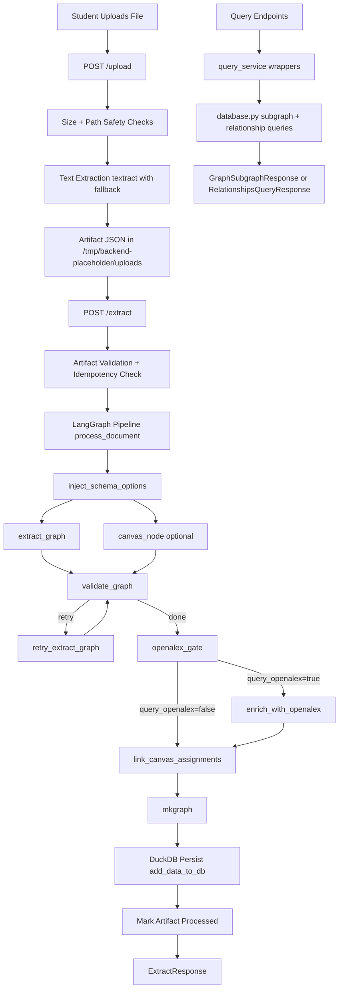
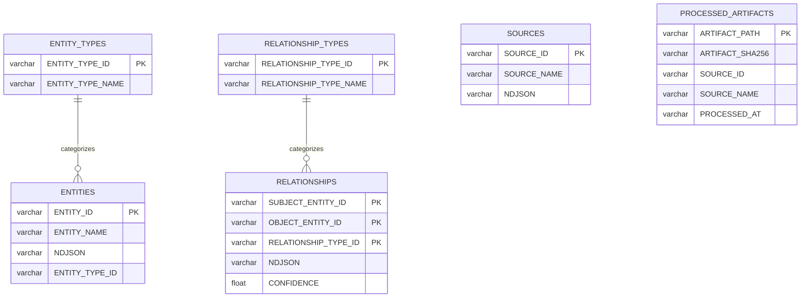
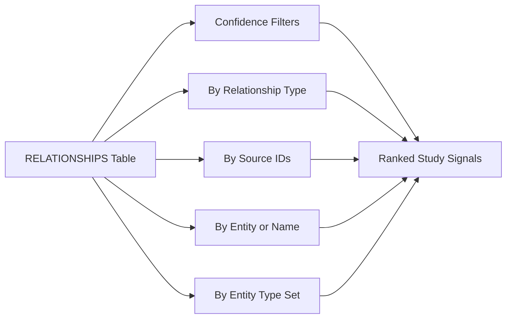

# BackendPlaceholder API

BackendPlaceholder is a FastAPI backend that turns uploaded class materials into a queryable knowledge graph for studying.

It is built for one clear student workflow:

1. Upload a document.
2. Extract structured entities and relationships with AI.
3. Query meaningful subgraphs for review and exam prep.

This README is API-first, demo-ready, and intentionally written for hackathon judges and technical reviewers.

---

## Why This Project Is Strong (and Judge-Friendly)

This project is unusually complete for a hackathon backend:

- **End-to-end pipeline**: document upload -> extraction pipeline -> persisted graph -> query APIs.
- **Typed contracts everywhere**: FastAPI + Pydantic request/response models keep behavior deterministic.
- **Real retrieval value**: confidence filtering, source-based subgraphs, entity-based subgraphs, and relationship-type views.
- **Safety guardrails built in**: artifact path sandboxing, file size limits, JSON suffix validation, and normalized error responses.
- **Idempotent processing**: already-processed artifacts are tracked to avoid duplicate extraction work.
- **Demo evidence exists**: local run artifacts show successful uploads/extractions and persisted graph data.

If the hackathon category is **Studying**, this is a direct fit: it transforms raw class content into a structured study graph students can actually query.

---

## Proof From Real Runs

These values come from local artifacts in this repo (`MY-CURL-COMMANDS.txt`, `knowledge.duckdb`):

### Upload + Extract Evidence

| Source | Uploaded? | Extracted? | Added Entities | Added Relationships |
|---|---:|---:|---:|---:|
| `chem-373-syllabus.pdf` | Yes | Yes | 97 | 4 |
| `nucleotides-lecture.pdf` | Yes | Yes | 40 | 4 |
| `nucleotide-synthesis-lecture.pdf` | Yes | Yes | 22 | 16 |

### Persisted Graph Snapshot

| Table | Rows |
|---|---:|
| `ENTITIES` | 159 |
| `RELATIONSHIPS` | 24 |
| `SOURCES` | 3 |
| `ENTITY_TYPES` | 5 |
| `RELATIONSHIP_TYPES` | 9 |
| `PROCESSED_ARTIFACTS` | 3 |

### Relationship Quality Snapshot

- Confidence min/avg/max: **0.70 / 0.843 / 0.95**
- Top relationship types observed: `APPLIES_TO (8)`, `CONTRASTS_WITH (6)`, `EXAMPLE_OF (4)`, `PREREQUISITE_OF (3)`

This is exactly what judges want: evidence that the system is not just scaffolded, but actually producing structured graph outputs.

---

## Demo Story (5 Minutes)

1. **Upload one class document** via `POST /upload`.
2. **Run extraction** via `POST /extract` and show `added_entities` / `added_relationships`.
3. **Query confidence-filtered relationships** via `GET /query/relationships`.
4. **Query a subgraph** by source or entity to show study-relevant context.
5. **Close with responsible AI**: confidence scores, validation rules, and error transparency.

---

## Architecture at a Glance



---

## What Happens in Plain English

### 1) Upload Stage

You send a file to `/upload`. The backend:

- validates size limits,
- extracts text,
- stores a normalized artifact JSON in a safe temp directory,
- returns a stable `artifact_path` + `artifact_sha256`.

### 2) Extract Stage

You send that artifact path to `/extract`. The backend:

- confirms the artifact path is allowed,
- checks if this artifact hash was already processed,
- runs extraction/enrichment pipeline,
- persists entities/relationships/sources into DuckDB,
- returns how many graph records were added.

### 3) Query Stage

You retrieve study context through focused query endpoints:

- relationship list with confidence bounds,
- source-based subgraphs,
- entity-centered neighborhoods,
- relationship-type and entity-type filtered subgraphs.

---

## Tech Stack

- Python 3.13+
- FastAPI + Pydantic
- LangGraph
- DuckDB
- Nix

---

## Quick Start

### 1) Enter dev shell

```bash
nix develop
```

### 2) Set environment variables

```bash
export OPENAI_API_KEY="your-openai-key"
export OPENALEX_API_KEY="your-openalex-key"   # optional
export CANVAS_API_KEY="your-canvas-key"       # optional
```

### 3) Run backend

```bash
nix run .#deploy-backend
```

Default URL: `http://localhost:8000`

---

## Core API Conventions

- Base URL: `http://localhost:8000`
- JSON endpoints use `application/json`
- Upload uses `multipart/form-data`
- Normalized service errors:

```json
{
  "detail": {
    "error_code": "string",
    "message": "human-readable message"
  }
}
```

- Validation failures are wrapped as HTTP 422 with `error_code: "validation_error"`.

---

## Endpoint Index

| Method | Path | Purpose |
|---|---|---|
| GET | `/health` | Liveness check |
| POST | `/upload` | Ingest file, extract text, create artifact |
| POST | `/extract` | Run KG extraction pipeline from artifact |
| GET | `/query/relationships` | List relationships with confidence filters |
| GET | `/query/subgraph/source/{source_id}` | Subgraph by one source |
| POST | `/query/subgraph/sources` | Subgraph by many sources |
| GET | `/query/subgraph/entity/{entity_id_or_name}` | Subgraph by entity ID or name |
| GET | `/query/relationships/type/{relationship_type}` | Subgraph by relationship type |
| POST | `/query/subgraph/entity-types` | Subgraph by entity type list |

---

## Example API Calls

### Upload

```bash
curl -X POST "http://localhost:8000/upload" \
  -F "file=@/path/to/lecture.pdf"
```

### Extract

```bash
curl -X POST "http://localhost:8000/extract" \
  -H "Content-Type: application/json" \
  -d '{
    "artifact_path": "/tmp/backend-placeholder/uploads/artifact-<id>.json",
    "query_canvas": false,
    "query_openalex": false
  }'
```

### Confidence-filtered relationships

```bash
curl "http://localhost:8000/query/relationships?min_confidence=0.8&limit=25"
```

---

## Ontology, Human-Readable

The graph is intentionally constrained so outputs stay understandable for student study workflows.

### Entity Taxonomy

| Entity Type | What It Represents | Example |
|---|---|---|
| `Concept` | Core ideas/topics | "DNA replication" |
| `Theory` | Explanatory frameworks | "Central dogma" |
| `Person` | Researchers/notable figures | "Watson" |
| `Method` | Techniques/procedures | "PCR" |
| `Assignment` | Coursework artifacts | "Quiz 2" |

### Relationship Semantics Matrix

| Relationship | Meaning |
|---|---|
| `PREREQUISITE_OF` | Subject should be learned before object |
| `EXAMPLE_OF` | Subject is an example of object |
| `CONTRASTS_WITH` | Subject differs from object in meaningful way |
| `LOCATED_IN` | Subject is within/part of object |
| `PRODUCES` | Subject produces object |
| `CONSUMES` | Subject uses object as input |
| `APPLIES_TO` | Theory/method applies to concept/domain |
| `ASSESSED_BY` | Concept/theory evaluated by assignment |
| `COVERS` | Assignment covers/tests concept/theory/method |

### Provenance (Why This Matters)

Each relationship can include provenance metadata (source document, section, page, extraction timestamp, raw text snippet), which helps:

- trace a claim back to source material,
- explain confidence to end users,
- support responsible AI review in demos.

---

## DuckDB Schema Visualization



### Why this schema works well

- `PROCESSED_ARTIFACTS` supports idempotency checks for extraction calls.
- Composite PK in `RELATIONSHIPS` prevents duplicate `(subject, object, type)` edges.
- Confidence index supports ranked retrieval workflows.
- NDJSON payload columns preserve rich metadata while keeping table schema stable.

---

## Query Surface at a Glance



The important product point: students do not just "search text" - they retrieve **structured connections**.

---

## Responsible AI Positioning

### Strong claims you can make confidently

- AI extraction is integrated into a deterministic API workflow.
- Confidence scoring is first-class in returned relationships.
- Validation and error normalization are explicit and inspectable.
- Path and resource safeguards are enforced in upload/extract flow.

### Careful wording to stay technically honest

- This is **AI-assisted extraction**, not guaranteed perfect extraction.
- This is a **hackathon-grade backend prototype**, not a production deployment.
- DuckDB location in `/tmp` is practical for demos but not durable production storage.
- External enrichment (`Canvas`, `OpenAlex`) is optional and key-dependent.

This framing is both persuasive and credible.

---

## Project Structure

```text
lib/backend_placeholder/
  api.py                    # FastAPI routes + HTTP error translation
  models.py                 # Pydantic request/response contracts
  agent.py                  # LangGraph pipeline assembly + process_document
  database.py               # DuckDB schema, writes, and query functions
  services/
    upload_service.py       # Upload ingestion + artifact creation
    extract_service.py      # Artifact-to-graph extraction + persistence
    query_service.py        # API-facing query wrappers
    path_safety.py          # Upload root sandbox + path validation
    textract_adapter.py     # Timeout-guarded text extraction adapter
```

---

## Useful Commands

```bash
# Run backend
nix run .#deploy-backend

# Lint
flake8 lib/

# Build Docker image
nix build .#docker
```

---

## Current Scope Limitations

- Automated test suite is not fully configured in this repository snapshot.
- Auth and rate limiting are intentionally out of scope for hackathon velocity.
- Local tmp-based storage is optimized for rapid demos, not long-term persistence.

---

## What Judges Can Verify Quickly

- **Technical impressiveness**: upload -> extract -> query pipeline with persisted graph and typed contracts.
- **Impact**: directly useful for transforming study materials into queryable context.
- **Product thinking**: clear problem, clear capability, clear demo narrative.
- **Use of AI**: AI is central in extraction and enrichment path, not bolted on.
- **Ethics and safety**: confidence, validation, path safety, and transparent error behavior are explicit.
