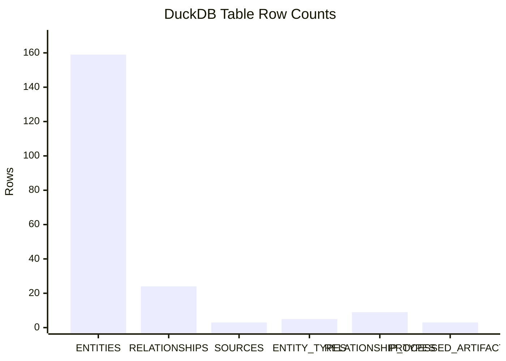
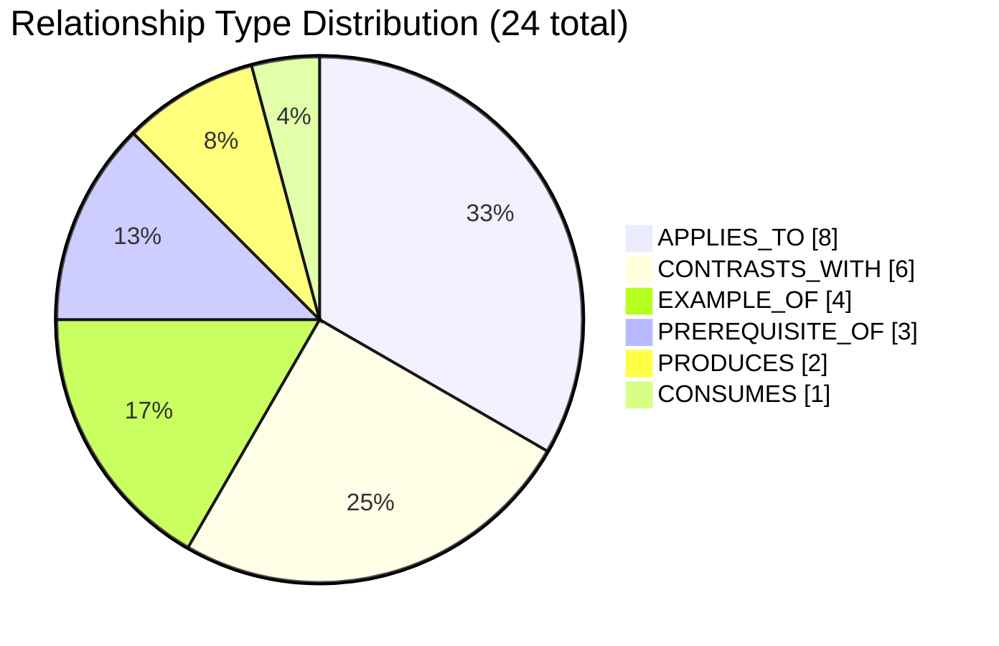
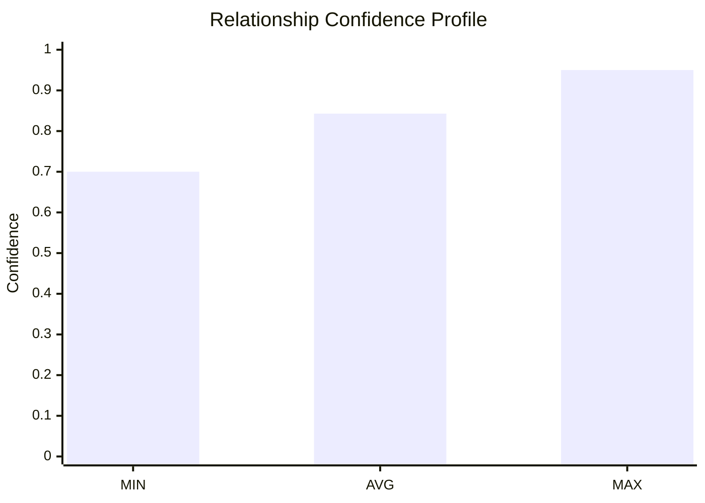
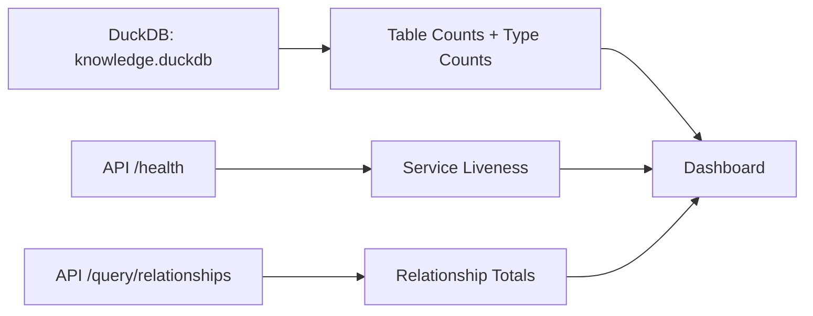

# Knowledge Graph Live Dashboard

This dashboard is generated from the current local DuckDB file and live API endpoint responses.

Data source snapshot:

- DuckDB: `knowledge.duckdb`
- API health: `GET http://localhost:8000/health`
- API relationships: `GET http://localhost:8000/query/relationships?limit=1000`

---

## System Health

| Signal | Value |
|---|---|
| API health | `ok` |
| API relationship total | `24` |
| API relationship items returned (`limit=1000`) | `24` |

---

## Database Volume Snapshot

| Table | Rows |
|---|---:|
| `ENTITIES` | 159 |
| `RELATIONSHIPS` | 24 |
| `SOURCES` | 3 |
| `ENTITY_TYPES` | 5 |
| `RELATIONSHIP_TYPES` | 9 |
| `PROCESSED_ARTIFACTS` | 3 |



---

## Relationship Type Distribution



---

## Confidence Profile

| Metric | Value |
|---|---:|
| Min | 0.7000 |
| Avg | 0.8429 |
| Max | 0.9500 |



---

## End-to-End Data Flow (Live)



---

## Recompute These Numbers

Run this from repo root to re-check live values:

```bash
python3 - <<'PY'
import json, duckdb, urllib.request
con = duckdb.connect('knowledge.duckdb', read_only=True)
counts = {t: con.execute(f"SELECT COUNT(*) FROM {t}").fetchone()[0] for t in ['ENTITIES','RELATIONSHIPS','SOURCES','ENTITY_TYPES','RELATIONSHIP_TYPES','PROCESSED_ARTIFACTS']}
rel = con.execute('SELECT RELATIONSHIP_TYPE_ID, COUNT(*) c FROM RELATIONSHIPS GROUP BY 1 ORDER BY c DESC, 1').fetchall()
conf = con.execute('SELECT MIN(CONFIDENCE), AVG(CONFIDENCE), MAX(CONFIDENCE) FROM RELATIONSHIPS WHERE CONFIDENCE IS NOT NULL').fetchone()
con.close()
health = json.loads(urllib.request.urlopen('http://localhost:8000/health', timeout=10).read().decode('utf-8'))
rels = json.loads(urllib.request.urlopen('http://localhost:8000/query/relationships?limit=1000', timeout=10).read().decode('utf-8'))
print(json.dumps({
  'db_counts': counts,
  'db_relationship_type_counts': rel,
  'db_confidence': conf,
  'api_health': health,
  'api_relationship_total': rels.get('total'),
  'api_relationship_items': len(rels.get('items', []))
}, indent=2))
PY
```
